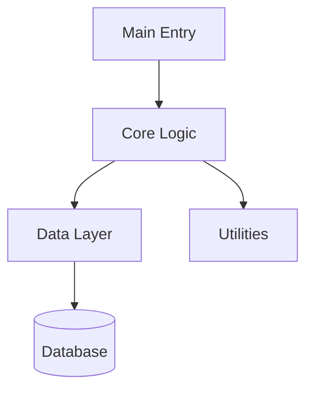

# Documentation Types Comparison

## Overview

This document compares the three types of documentation that can be generated by the Automated Documentation Generator.

## Feature Comparison

| Feature | Technical Doc | Business Doc | **README (NEW)** |
|---------|--------------|--------------|------------------|
| **Target Audience** | Developers | Business Stakeholders | Everyone (Developers + Users) |
| **Detail Level** | Very Detailed | High-Level | Comprehensive |
| **Code Examples** | Yes, detailed | No | Yes, practical |
| **API Documentation** | Yes, complete | No | Yes, key APIs |
| **Architecture Info** | Some | No | **Yes + Diagrams** |
| **Setup Instructions** | No | No | **Yes, detailed** |
| **Usage Examples** | Code-focused | No | **Yes, multiple types** |
| **Business Context** | No | Yes, detailed | Some |
| **Diagrams** | No | No | **Yes, multiple types** |
| **Troubleshooting** | No | No | **Yes** |
| **Contributing Guide** | No | No | **Yes** |
| **Quick Start** | No | No | **Yes** |
| **Configuration Docs** | No | No | **Yes** |
| **Best For** | Internal devs | Executives, PMs | New users, contributors, GitHub |

## When to Use Each

### Use Technical Documentation When:
- You need detailed API reference
- Documenting for internal development team
- Need complete function/class documentation
- Want to see every parameter and return type
- Need low-level implementation details

**Example Use Case**: Internal wiki for development team

### Use Business Documentation When:
- Presenting to non-technical stakeholders
- Need executive summary
- Want business capabilities overview
- Documenting for sales/marketing
- Need risk assessment and roadmap

**Example Use Case**: Board meeting presentation

### Use README Documentation When:
- Publishing open-source project
- Onboarding new developers
- Need GitHub/GitLab README
- Want comprehensive project documentation
- Need setup and getting started guide
- Want visual architecture overview

**Example Use Case**: GitHub repository README

### Use All Three When:
- Complete project documentation needed
- Different audiences to serve
- Building comprehensive documentation suite
- Launching major release

**Example Use Case**: Product launch with multiple stakeholder types

## Content Comparison

### Technical Documentation Contains:

```markdown
# Technical Documentation

## File Analysis
### file1.py
- Functions: func1(), func2()
  - Parameters: detailed types
  - Returns: detailed types
  - Examples: code snippets
- Classes: Class1, Class2
  - Methods: detailed signatures
  - Attributes: with types

### file2.py
[... same structure ...]

## Module Dependencies
- imports and relationships
```

**Pros:**
- ✅ Extremely detailed
- ✅ Complete API reference
- ✅ Type information
- ✅ Code examples

**Cons:**
- ❌ No visual diagrams
- ❌ No setup instructions
- ❌ Can be overwhelming
- ❌ Not beginner-friendly

### Business Documentation Contains:

```markdown
# Business Documentation

## Executive Summary
High-level overview of what the system does

## Capabilities
- Business capability 1
- Business capability 2

## User Journeys
How users interact with the system

## Inputs & Outputs
What goes in, what comes out

## Operations
How the system operates

## Security & Privacy
Security considerations

## Risks & Mitigations
Potential risks and solutions

## Glossary
Key terms defined

## Roadmap
Future plans
```

**Pros:**
- ✅ Non-technical language
- ✅ Business-focused
- ✅ Strategic view
- ✅ Risk assessment

**Cons:**
- ❌ No code examples
- ❌ No technical details
- ❌ No setup instructions
- ❌ No architecture diagrams

### README Documentation Contains:

```markdown
# Project Name

## Overview
What is this project?

## Features
- Detected features with descriptions

## Architecture
[Mermaid Diagram]
Explanation of architecture

## Directory Structure
[Folder Structure Diagram]
Explanation of each directory

## Getting Started
### Prerequisites
### Installation
### Configuration

## Usage
### Basic Usage
[Code Examples]
### Advanced Usage
### API Documentation

## Development
### Setup Dev Environment
### Project Structure
### Adding Features
### Code Style

## Testing
How to run and write tests

## Deployment
Build and deploy instructions

## Troubleshooting
Common issues and solutions

## Contributing
How to contribute

## License
License information
```

**Pros:**
- ✅ Visual diagrams (Mermaid)
- ✅ Setup instructions
- ✅ Multiple examples
- ✅ Beginner-friendly
- ✅ Comprehensive
- ✅ Professional structure
- ✅ Actionable information
- ✅ Troubleshooting included

**Cons:**
- ❌ Not as detailed as technical docs
- ❌ Less business context than business docs
- ❌ Takes longer to generate (LLM intensive)

## Visual Example

### What Each Looks Like

#### Technical Doc (Excerpt)
```markdown
### Function: `process_data`
**Signature:** `process_data(input_data: Dict[str, Any], config: Config) -> Result`

**Parameters:**
- `input_data` (Dict[str, Any]): The input dictionary containing...
- `config` (Config): Configuration object with settings...

**Returns:**
- `Result`: A Result object containing processed data...

**Examples:**
```python
result = process_data({"key": "value"}, config)
print(result.output)
```
```

#### Business Doc (Excerpt)
```markdown
## Capabilities
This system provides the following business capabilities:

1. **Data Processing**: Transforms raw data into actionable insights
   - Handles multiple data formats
   - Ensures data quality
   - Provides real-time processing

2. **Reporting**: Generates comprehensive reports
   - Customizable templates
   - Multiple export formats
   - Scheduled generation
```

#### README (Excerpt)
```markdown
## Architecture



The project follows a layered architecture pattern...

## Getting Started

### Installation

```bash
# Clone the repository
git clone https://github.com/user/project.git

# Install dependencies
pip install -r requirements.txt

# Configure the application
cp config.example.yaml config.yaml
```

### Basic Usage

```python
from project import Application

# Create application instance
app = Application()

# Run with default settings
app.run()
```
```

## Size Comparison

Typical sizes for a medium project (50 files, 5000 LOC):

| Type | Lines | Pages (printed) | Generation Time |
|------|-------|----------------|-----------------|
| Technical | ~3,000 | ~60 pages | 1-2 minutes |
| Business | ~800 | ~15 pages | 30-60 seconds |
| **README** | **~1,200** | **~25 pages** | **1-2 minutes** |

## Use Case Scenarios

### Scenario 1: Open Source Project
**Goal**: Attract contributors and users

**Recommended**: ✅ README + Technical

**Why**: 
- README for GitHub landing page
- Technical for detailed API docs
- Business doc not needed (no stakeholders)

### Scenario 2: Enterprise Internal Tool
**Goal**: Document for team and management

**Recommended**: ✅ All Three

**Why**:
- Technical for developers
- Business for management
- README for onboarding new team members

### Scenario 3: Client Deliverable
**Goal**: Hand off to client

**Recommended**: ✅ README + Business

**Why**:
- README for their developers
- Business for their management
- Technical might be too detailed

### Scenario 4: API Library/SDK
**Goal**: Help developers integrate

**Recommended**: ✅ README + Technical

**Why**:
- README for getting started
- Technical for complete API reference
- Business not relevant

### Scenario 5: Proof of Concept
**Goal**: Quick demo for stakeholders

**Recommended**: ✅ Business Only

**Why**:
- Fast to generate
- Non-technical audience
- Quick overview needed

## Generation Time & Cost

Approximate times (local Ollama, medium project):

| Type | Analysis | LLM Calls | Total Time |
|------|----------|-----------|------------|
| Technical | 30s | 0 (template) | ~30s |
| Business | 30s | 1 (summary) | ~60s |
| **README** | **30s + 15s** | **1 (comprehensive)** | **~120s** |
| **All Three** | **30s + 15s** | **2** | **~180s** |

Note: Analysis is done once and shared across all doc types.

## Storage Comparison

Typical file sizes for medium project:

```
Documentation/
├── documentation.technical.md    (~300 KB)
├── documentation.technical.html  (~350 KB)
├── documentation.business.md     (~50 KB)
├── documentation.business.html   (~70 KB)
├── README.md                     (~80 KB)  ← Includes diagrams
└── README.html                   (~100 KB)

Total: ~950 KB (~1 MB)
```

## Summary Table

| Criterion | Technical | Business | README |
|-----------|-----------|----------|--------|
| Completeness | ⭐⭐⭐⭐⭐ | ⭐⭐⭐ | ⭐⭐⭐⭐ |
| Beginner Friendly | ⭐⭐ | ⭐⭐⭐⭐⭐ | ⭐⭐⭐⭐⭐ |
| Visual Appeal | ⭐⭐ | ⭐⭐⭐ | ⭐⭐⭐⭐⭐ |
| Code Detail | ⭐⭐⭐⭐⭐ | ⭐ | ⭐⭐⭐ |
| Setup Guide | ⭐ | ⭐ | ⭐⭐⭐⭐⭐ |
| Quick Reference | ⭐⭐⭐ | ⭐⭐⭐⭐ | ⭐⭐⭐⭐⭐ |
| Maintenance | ⭐⭐⭐ | ⭐⭐⭐⭐ | ⭐⭐⭐⭐ |

## Recommendation

**For most projects**, we recommend:

🥇 **Option 5 (All)** for complete documentation
🥈 **Option 4 (README)** as minimum viable documentation
🥉 **Options 1-3** for specific use cases

The new **README generation** provides the best bang for your buck:
- ✅ Comprehensive yet accessible
- ✅ Visual and engaging
- ✅ Professional structure
- ✅ Practical and actionable
- ✅ Suitable for most audiences

---

*Choose based on your specific needs, but when in doubt, generate all three!*
