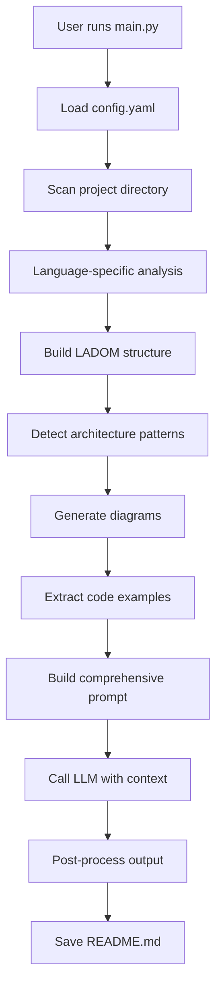

# Automated Documentation Generator

**Generate comprehensive, developer-focused README documentation for any project automatically.**

Analyzes your codebase and creates in-depth README.md files with architecture diagrams, API documentation, usage examples, and development guides using local LLM (Ollama). No API keys required—completely private and runs on your machine.

---

## ✨ Features

- 🔍 **Multi-language support**: Python, JavaScript, TypeScript, Java (extensible analyzer architecture)
- 📄 **Single Comprehensive Output**: One README.md with both technical depth and business context
- 🏗️ **Architecture Analysis**: Automatically detects patterns (MVC, Layered, Clean Architecture, Microservices)
- 📊 **Visual Diagrams**: Generates 5 types of Mermaid diagrams (architecture, dependencies, folder structure, data flow, class diagrams)
- 💻 **Developer-Focused**: Optimized for developers/architects understanding new codebases quickly
- 🔎 **Code Navigation**: Helps find specific functionality with "where to look" guidance
- 📝 **Real Examples**: Extracts actual code examples, configuration files, CLI usage from your project
- 🧠 **Local LLM**: Uses Ollama (default: `qwen2.5-coder:14b`)
- 🧱 **LADOM Schema**: Language-Agnostic Document Object Model for consistent multi-language analysis
- ⚡ **Parallel processing**: Multi-threaded code analysis for speed
- 💾 **Smart caching**: Avoids redundant LLM calls with docstring caching
- 🔐 **Security-first**: Path validation, runs completely offline, no external API calls
- ⚙️ **Highly configurable**: YAML config for all settings and output customization

---

## 🎯 What It Generates

The generator creates a single, comprehensive **README.md** with 18 sections:

1. **TL;DR** - 30-second overview
2. **Project Overview** - What it does and why it exists
3. **Architecture & Design** - Patterns, decisions, diagrams
4. **Codebase Structure** - Folder organization with navigation guide
5. **Core Components** - Detailed breakdown of top 12 components with APIs
6. **Key APIs & Interfaces** - Function signatures, parameters, usage
7. **Data Models & Schemas** - Data structures and validation
8. **Workflows & Data Flow** - Sequence diagrams and process flows
9. **Getting Started** - Prerequisites, installation, configuration
10. **Usage Guide** - Basic and advanced usage with examples
11. **Development Guide** - Contributing, code organization, dev setup
12. **Testing** - Running tests, writing tests, CI/CD
13. **Troubleshooting & FAQ** - Common issues and solutions
14. **Architecture Decisions** - Why certain choices were made
15. **Dependencies & Licenses** - External libraries and licensing
16. **Performance & Scalability** - Metrics and optimization notes
17. **Security Considerations** - Security features and best practices
18. **Contact & Support** - Maintainers and contribution info

Each README includes **real code examples**, **Mermaid diagrams**, and **actionable guidance** for developers.

---

## 🚀 Quick Start

### Prerequisites

- **Python 3.8+**
- **Ollama** installed and running locally

### Install Ollama

1. Download from [ollama.ai](https://ollama.ai)
2. Pull the model:
   ```bash
   ollama pull qwen2.5-coder:14b
   ```

**For faster generation (recommended for testing):**
```bash
ollama pull qwen2.5-coder:7b
```

**Windows Tip**: Keep model files on a fast NVMe drive:
```powershell
$env:OLLAMA_MODELS = 'D:\ollama\models'
ollama serve
```

### Install the Generator

```bash
git clone <repo-url>
cd automated-doc-generator
pip install -r requirements.txt
```

### Generate Documentation

```bash
python -m src.main
```

You'll be prompted for the project path:
```
Enter the project path to analyze: /path/to/your/project
```

The generator will:
1. Scan and analyze all source files
2. Detect architecture patterns
3. Generate Mermaid diagrams
4. Extract code examples
5. Create comprehensive README.md with LLM

**Output location**: `Documentation/<project-name>/README.md`

---

## ⚙️ Configuration

Edit `config.yaml` to customize behavior:

```yaml
# Directories and patterns to exclude
exclude_patterns:
  - node_modules
  - venv
  - __pycache__
  - .git
  - dist
  - build
  - target
  - .idea
  - .vscode

# File types to include
include_file_types:
  - .py
  - .js
  - .ts
  - .java
  - .json
  - .yaml
  - .yml
  - .md
  - .txt

# LLM configuration
llm:
  provider: ollama
  base_url: http://localhost:11434
  model: qwen2.5-coder:14b  # or qwen2.5-coder:7b for speed
  temperature: 0.3
  timeout: 400  # seconds (increase for large projects or slow hardware)
  max_retries: 5

# Output configuration
output:
  directory: Documentation
  filename: README.md

# README generation settings
readme:
  target_audience: "developers"  # optimized for technical audience
  detail_level: "comprehensive"
  include_diagrams: true
  include_code_examples: true
  include_api_docs: true
  include_architecture: true
  include_workflows: true
  include_setup_guide: true
  include_troubleshooting: true
  include_dev_guide: true
  max_diagram_nodes: 15
  max_code_examples: 8
  max_components_detailed: 12  # top N components to analyze in depth
  max_functions_per_component: 6
```

---

## 🏗️ Architecture

### Core Components

```
src/
├── main.py                      # CLI entry point
├── readme_generator.py          # Main generator orchestrator
├── project_analyzer.py          # Architecture and structure analysis
├── ladom_schema.py             # Language-Agnostic Document Object Model
├── config_loader.py            # Configuration management
├── rate_limiter.py             # LLM request throttling
├── cache_manager.py            # Docstring caching
├── path_validator.py           # Security path validation
│
├── analyzers/                   # Language-specific analyzers
│   ├── base_analyzer.py        # Abstract base class
│   ├── py_analyzer.py          # Python AST analysis
│   ├── js_analyzer.py          # JavaScript analysis
│   ├── ts_analyzer.py          # TypeScript analysis
│   └── java_analyzer.py        # Java analysis
│
├── providers/
│   └── ollama_client.py        # Ollama LLM integration
│
└── utils/
    ├── diagram_generator.py    # Mermaid diagram creation
    ├── example_extractor.py    # Code example extraction
    ├── markdown_builder.py     # Markdown formatting utilities
    ├── ast_utils.py            # AST parsing helpers
    └── text_utils.py           # Text processing utilities
```

### How It Works



### Key Design Patterns

- **Strategy Pattern**: Language-specific analyzers inherit from `BaseAnalyzer`
- **Builder Pattern**: `MarkdownBuilder` for constructing documentation
- **Factory Pattern**: Analyzer selection based on file extension
- **Singleton Pattern**: `CacheManager` for shared docstring cache
- **Template Method**: `BaseAnalyzer` defines analysis workflow

---

## 📖 Usage Examples

### Basic Usage

```bash
# Generate README for current directory
python -m src.main
# Enter: .

# Generate for specific project
python -m src.main
# Enter: /path/to/project
```

### With Custom Configuration

```bash
# Use custom config file
python -m src.main --config my-config.yaml
```

### Environment Variables

Override timeout for large projects:
```bash
# Unix/Mac
export DOCGEN_TIMEOUT=600
python -m src.main

# Windows PowerShell
$env:DOCGEN_TIMEOUT=600
python -m src.main
```

### Output Examples

After generation, you'll find:
```
Documentation/
└── your-project-name/
    └── README.md  (comprehensive, 1000-3000 lines)
```

The README includes:
- **Architecture diagrams** showing component relationships
- **Dependency graphs** with internal and external dependencies
- **Folder structure** with visual tree
- **Code examples** extracted from your actual codebase
- **API documentation** with function signatures
- **Setup instructions** based on detected package managers
- **Troubleshooting guide** with common issues

---

## 🧪 Testing

### Run Tests

```bash
# Run all tests
pytest

# Run with coverage
pytest --cov=src --cov-report=html

# Run specific test file
pytest tests/test_analyzers.py

# Run with verbose output
pytest -v
```

### Test Structure

```
tests/
├── test_analyzers.py          # Language analyzer tests
├── test_cache_manager.py      # Cache functionality tests
└── test_ladom_schema.py       # Schema validation tests
```

---

## 🛠️ Development

### Adding a New Language Analyzer

1. Create analyzer in `src/analyzers/`:
   ```python
   from analyzers.base_analyzer import BaseAnalyzer
   
   class RustAnalyzer(BaseAnalyzer):
       def __init__(self):
           super().__init__(language="rust", file_extensions=[".rs"])
       
       def analyze_file(self, file_path: str) -> dict:
           # Implement Rust-specific analysis
           pass
   ```

2. Register in `main.py`:
   ```python
   from analyzers.rust_analyzer import RustAnalyzer
   
   analyzers = {
       ".rs": RustAnalyzer(),
       # ... other analyzers
   }
   ```

3. Add tests in `tests/test_analyzers.py`

### Project Structure

- **src/analyzers/**: Language-specific code analysis
- **src/providers/**: LLM provider implementations
- **src/utils/**: Shared utilities (diagrams, markdown, text)
- **tests/**: Unit and integration tests
- **config.yaml**: Main configuration file
- **setup.py**: Package installation script

### Code Style

- **PEP 8** compliance for Python
- **Type hints** for all function signatures
- **Docstrings** for all public methods
- **Logging** for debugging (use `logging` module)

---

## 🐛 Troubleshooting

### Timeout Errors

**Problem**: `Timeout after 5 attempts`

**Solutions**:
1. Increase timeout in `config.yaml`:
   ```yaml
   llm:
     timeout: 600  # increase from 400
   ```
2. Use smaller model:
   ```bash
   ollama pull qwen2.5-coder:7b
   ```
3. Set environment variable:
   ```bash
   export DOCGEN_TIMEOUT=900
   ```

### Ollama Connection Errors

**Problem**: `Connection refused to localhost:11434`

**Solutions**:
1. Start Ollama:
   ```bash
   ollama serve
   ```
2. Check if Ollama is running:
   ```bash
   curl http://localhost:11434/api/tags
   ```

### Empty or Poor Quality Output

**Problem**: Generated README is too short or missing sections

**Solutions**:
1. Check if Ollama model is fully downloaded:
   ```bash
   ollama list
   ```
2. Ensure project has enough source files to analyze
3. Increase `max_components_detailed` in config.yaml
4. Try different model:
   ```bash
   ollama pull qwen2.5-coder:32b
   ```

### Memory Issues

**Problem**: Out of memory errors

**Solutions**:
1. Use smaller model (`7b` instead of `14b` or `32b`)
2. Reduce `max_diagram_nodes` in config
3. Add more directories to `exclude_patterns`
4. Close other applications during generation

---

## 🚦 Performance

### Benchmarks (Typical)

| Project Size | Files | Time (7b model) | Time (14b model) |
|--------------|-------|-----------------|------------------|
| Small (<50 files) | 20-50 | 2-3 min | 4-6 min |
| Medium (50-200 files) | 50-200 | 5-8 min | 10-15 min |
| Large (200-500 files) | 200-500 | 10-15 min | 20-30 min |
| Very Large (500+ files) | 500+ | 15-25 min | 30-60 min |

*Times vary based on hardware (CPU, RAM, GPU), model size, and project complexity.*

### Optimization Tips

1. **Use faster model** for testing: `qwen2.5-coder:7b`
2. **Enable caching**: Docstring cache speeds up repeated runs
3. **Exclude unnecessary files**: Add to `exclude_patterns` in config
4. **GPU acceleration**: Use Ollama with CUDA/Metal for faster inference
5. **Reduce detail level**: Lower `max_components_detailed` for quicker generation

---

## 📋 Requirements

### System Requirements

- **Python**: 3.8 or higher
- **RAM**: 8GB minimum (16GB recommended for 14b model)
- **Storage**: 10GB+ for Ollama models
- **OS**: Windows, macOS, or Linux

### Python Dependencies

```
PyYAML>=6.0
requests>=2.31.0
pytest>=7.4.0
pytest-cov>=4.1.0
```

See [requirements.txt](requirements.txt) for full list.

### Optional Dependencies

- **GPU**: NVIDIA GPU with CUDA for faster LLM inference
- **watchdog**: For future watch mode feature

---

## 🗺️ Roadmap

See [FEATURES_BACKLOG.md](FEATURES_BACKLOG.md) for detailed feature planning.

### Upcoming Features

- [ ] **TypeScript Analyzer**: Better support for TS/TSX files
- [ ] **Watch Mode**: Auto-regenerate on file changes
- [ ] **Incremental Updates**: Update existing READMEs without full regeneration
- [ ] **Configuration Profiles**: Minimal, Standard, Comprehensive presets
- [ ] **Multi-format Export**: PDF, HTML (optional)
- [ ] **More Languages**: Rust, Go, C++, C# analyzers
- [ ] **Template System**: Customizable output templates
- [ ] **API Server**: REST API for documentation generation
- [ ] **VS Code Extension**: Generate docs from editor

### Recent Changes

#### v2.0 (January 2026) - Major Restructuring ✅
- **Consolidated generators**: Removed separate Technical/Business generators
- **Single comprehensive output**: One README.md with both technical and business content
- **Removed HTML generation**: Markdown-only output
- **Removed menu system**: Simplified CLI (always generates README)
- **Enhanced prompts**: Developer-first focus with 18 structured sections
- **Improved component analysis**: Top 12 components with detailed API docs

---

## 📜 License

This project is licensed under the MIT License - see [LICENSE](LICENSE) file for details.

---

## 🙏 Acknowledgments

- **Ollama** - For providing local LLM inference
- **Qwen Team** - For the qwen2.5-coder models
- **Mermaid** - For diagram generation syntax
- **Python AST** - For Python code analysis

---

## 📞 Support & Contributing

### Getting Help

- **Issues**: Open an issue on GitHub for bugs or feature requests
- **Discussions**: Use GitHub Discussions for questions and ideas
- **Documentation**: Check [QUICK_FIX.md](QUICK_FIX.md) for common issues

### Contributing

Contributions are welcome! To contribute:

1. Fork the repository
2. Create a feature branch: `git checkout -b feature/my-feature`
3. Make your changes with tests
4. Run tests: `pytest`
5. Commit: `git commit -m "Add my feature"`
6. Push: `git push origin feature/my-feature`
7. Open a Pull Request

**Areas for contribution**:
- New language analyzers (Rust, Go, C++, etc.)
- Diagram improvements
- Performance optimizations
- Documentation enhancements
- Bug fixes

---

## 🎯 Philosophy

This tool aims to solve a real problem: **understanding unfamiliar codebases quickly**. 

When developers join a new project or explore open-source code, they need:
- **Architecture overview** - How is it structured?
- **Navigation guidance** - Where is the authentication logic?
- **API documentation** - What functions are available?
- **Setup instructions** - How do I run this?
- **Code examples** - Show me real usage patterns

Traditional documentation tools generate generic API docs. This tool creates **developer-focused documentation** that answers the questions developers actually ask.

**Design principles**:
1. **Developer-first**: Optimized for technical audiences
2. **Comprehensive**: Single source of truth
3. **Actionable**: Navigation guidance, not just descriptions
4. **Privacy**: Runs locally, no external API calls
5. **Extensible**: Easy to add new languages and features

---

**Made with ❤️ for developers who want to understand code faster.**
